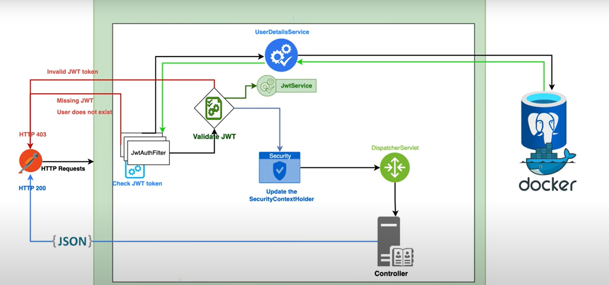
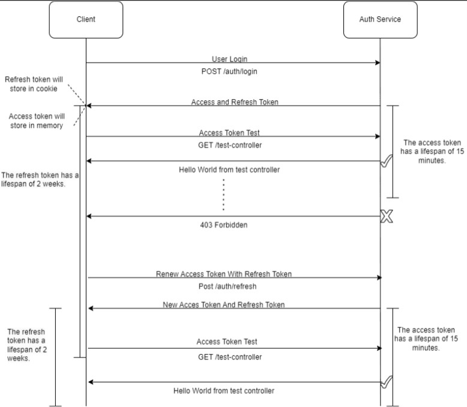

# Authentication and Authorization using jwt token include refresh token in Spring Boot

## How JWT security works

## Authentication Logic Flowchart

### Authentication Logic
- User sends username and password to the server
- Server validates the credentials and sends back an Access Token and Refresh Token
- User stores the Access Token in memory and Refresh Token in a cookie
- User sends the Access Token in the Authorization header of every request
- Server validates the Access Token and sends back the response
- If the Access Token is expired, user sends the Refresh Token in the Cookie
- Server validates the Refresh Token and sends back a new Access Token and Refresh Token

### Technologies
- Java 20
- Spring Boot 3.0.6
- Spring Data JPA
- Spring Security
- IO JSON Web Token
- PostgreSQL Database
- Lombok
- Restful API
- Maven

